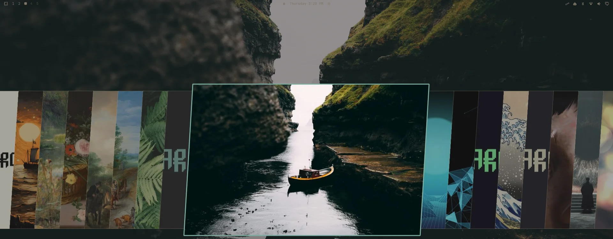
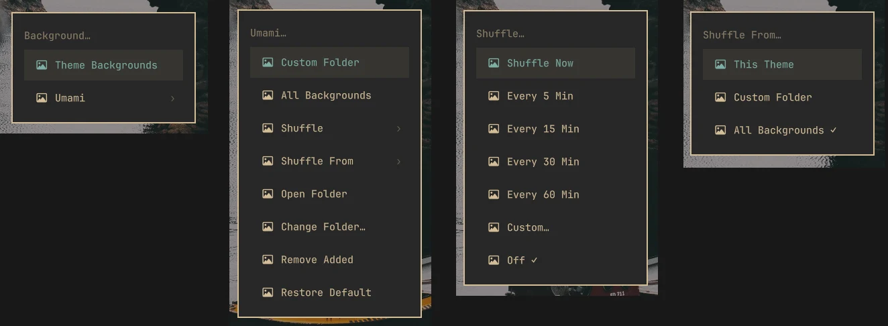
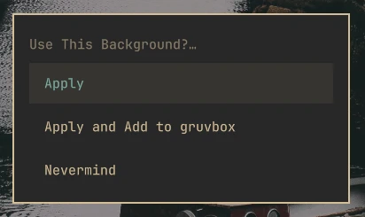

<p align="center"></p>

# Background Umami

**Umami for your background. Season to taste.**

Omarchy is omakase. Every theme comes with wallpapers the chef picked, and they're good. Umami is the seasoning on the table for when you want a little more: browse everything you've got, see it on your desktop *before* you commit, keep it when you change themes, or let it shuffle. Stock Omarchy stays exactly as it is.

<p align="center"></p>

## Why I made it

I wanted a little more quick customization. Changing a wallpaper shouldn't mean a trip through folders and file managers, or fighting your theme to keep the one you like. Pick it, see it, keep it. That's all this is.

- **Taste first.** Pick an image and it's on your desktop at once. Keep it, add it to the theme, or say nevermind.
- **Everything in one place.** Every theme's wallpapers plus your own folder, in Omarchy's own carousel.
- **Yours to keep.** A wallpaper you choose survives theme changes. Or let it shuffle.
- **No trace.** One command puts your menu back byte for byte.

## The menu

Omarchy's **Style → Background** keeps working exactly as it does. It just gains a second choice next to the stock picker:

```
Style → Background
  ├─ Theme Backgrounds      the stock picker, untouched
  └─ Umami
       ├─ Custom Folder     your own wallpapers
       ├─ All Backgrounds   every wallpaper from every theme, plus yours
       ├─ Shuffle           now, every 5 / 15 / 30 / 60 min, custom, off
       ├─ Shuffle From      this theme, custom folder, or all backgrounds
       ├─ Open Folder       show your wallpaper folder in Files
       ├─ Change Folder…    use a different folder
       ├─ Remove Added      take one back out of the theme
       └─ Restore Default   back to the theme's own
```

<p align="center"></p>

## Taste before you commit

Pick an image and it's applied straight away. Then choose:

- **Apply**: keep it. It stays when you switch themes.
- **Apply and Add to _theme_**: keep it, and add it to that theme's own backgrounds.
- **Nevermind**: put the old one back and keep browsing.

<p align="center"></p>

## Install

1. Open **Setup → Plugins → Add Plugin**.
2. Paste `https://github.com/samjage/omarchy-background-umami` and say yes.
3. A setup window opens by itself. It says what will change and asks before doing anything. Choose **Set up**, then pick where your wallpapers live from a short list.

That's it. Style → Background now has Umami in it.

If the setup window doesn't open, run it yourself:

```sh
~/.config/omarchy/plugins/io.github.samjage.background-umami/bin/umami-install
```

You can also add it from a terminal:

```sh
omarchy plugin add https://github.com/samjage/omarchy-background-umami --enable
```

If that ends with `omarchy-shell is not responding`, the plugin was still added. That's a known Omarchy quirk (it waits only two seconds for the shell to finish reloading). Check with `omarchy plugin list`, or give it longer:

```sh
OMARCHY_SHELL_IPC_TIMEOUT=15s omarchy plugin add https://github.com/samjage/omarchy-background-umami --enable
```

**Updating:** run `omarchy plugin update`, then the setup command above once more so any new menu rows are added. It's safe to run again at any time.

## Remove

Remove it in this order, because Omarchy's own **Remove Plugin** deletes the plugin without running any cleanup:

```sh
~/.config/omarchy/plugins/io.github.samjage.background-umami/bin/umami-uninstall --purge
```

Then **Setup → Plugins → Remove Plugin → Background Umami**.

Your menu file comes back **byte for byte**, and the theme hook, any shuffle timer, and Umami's settings, cache and saved pick are removed (leave off `--purge` to keep the settings). Your wallpapers are never touched, including the ones you added to a theme: they're your files, and Omarchy's own picker uses them.

If you removed the plugin first, nothing is broken, but Style → Background keeps a one-item submenu. Add the plugin again, run the removal command above, then remove the plugin once more.

## Where do my wallpapers go?

In a folder inside your Pictures folder. If you already have a `Backgrounds` or `Wallpapers` folder there (any capitalization), Umami uses it as it is: it never moves, renames or writes into it. If you have none, setup offers to create `~/Pictures/Backgrounds`. Your system's own Pictures location is used, so a translated name works too.

Drop images in, and they appear under **Custom Folder**, **All Backgrounds** and **Shuffle From → Custom Folder**. Subfolders count, up to 4 levels down.

**Open Folder** shows it in Files, and **Change Folder…** lets you pick another from a short list, or browse your folders with the arrow keys. No typing.

## Shuffle

Pick a time and Umami changes the wallpaper on that schedule. It deals from a shuffled bag, so every wallpaper is shown once before any repeats, and it picks up where it left off after a reboot. The current interval and source get a check mark in the menu. "Custom…" takes any whole number of minutes from 1 to 1440.

The schedule is a systemd user timer that Umami creates when you turn shuffle on and deletes when you turn it off, so nothing runs in between and nothing is left behind. Choosing a wallpaper yourself (Apply, Restore Default, or the stock picker) ends the shuffle, so the two never fight. A theme change keeps the current shuffled wallpaper.

## What it changes

Setup touches exactly these, and `umami-uninstall` undoes each one:

- A clearly marked block in `~/.config/omarchy/extensions/omarchy-menu.jsonc`. It refuses to touch that file if it doesn't parse, if something else already overrides `style.background`, or if the markers are damaged. Nothing is written until the result has been checked the way Omarchy will read it.
- A three-line hook in `~/.config/omarchy/hooks/theme-set.d/` that restores your pick after a theme change.
- While shuffle is on, two small units in `~/.config/systemd/user/`.
- Settings, cache and your saved pick in `~/.config/omarchy-background-umami`, `~/.cache/omarchy-background-umami` and `~/.local/state/omarchy-background-umami`.

Nothing else is changed, and no network access is used.

## How it behaves

- Only images inside a theme's `backgrounds/` folder count as theme wallpapers, so previews and README art never show up.
- The carousel is Omarchy's own picker, fed lighter thumbnails (768×432 instead of 1536×864), so scrolling through hundreds of wallpapers takes about a tenth of the extra memory. The first look at a new folder makes them, then they're cached.
- Your wallpaper folder is searched up to 4 levels deep, capped at 2000 images. It can't be `/` or your home folder.
- If you later pick a wallpaper with the stock picker, Umami lets go of your earlier pick.
- It works with ordinary image wallpapers. Animated and video wallpaper plugins draw on their own, and Umami doesn't manage them.

## Requirements

Omarchy 4 (Quattro). It uses `jq`, `perl`, `cmp`, `flock`, `gum` and `vipsthumbnail`, which Omarchy already includes, and a systemd user session for shuffle. Setup checks for `jq`, `perl`, `cmp` and `flock` before it changes anything. Tested on Omarchy 4.0.4.

## Development

```sh
test/run          # plain bash, throwaway home, nothing on your machine is touched
```

MIT licensed. Season to taste.
